# gdev-agent

    

`gdev-agent` is a governed, multi-tenant LLM workflow reliability system for
game-studio support: it receives support webhooks, blocks unsafe input before
any model call, classifies and extracts structured data with an LLM, routes
risky actions into human approval, and records the resulting audit, cost, and
analytics trail behind one HTTP API.

Status: local evidence baseline complete. The current stack is pilot-grade:
Docker Compose setup, synthetic demo and eval paths, and repository tests. This
README does not claim production SaaS readiness, external deployment, or live
customer usage.

## Evidence Path

For a claim-by-claim proof map, start with
[docs/EVIDENCE_INDEX.md](docs/EVIDENCE_INDEX.md).

| Claim to inspect | Start here | Bounded status |
| --- | --- | --- |
| Evidence question map | [docs/EVIDENCE_INDEX.md#evidence-questions](docs/EVIDENCE_INDEX.md#evidence-questions) | One-click route for problem, architecture, controls, quality, failure behavior, metrics, demo, limits, and production changes |
| Three-project stack map | [docs/STACK_OVERVIEW.md](docs/STACK_OVERVIEW.md) | Explains how gdev-agent, Eval Ground Truth Lab, and Agent Runtime Grid fit together as workflow, quality, and runtime layers |
| One-page engineering story | [docs/CASE_STUDY.md](docs/CASE_STUDY.md) | Evidence-backed case study for problem, architecture, controls, eval, load, trade-offs, and production changes |
| Architecture and workflow boundaries | [docs/ARCHITECTURE.md](docs/ARCHITECTURE.md), [docs/architecture-diagram.md](docs/architecture-diagram.md) | Implemented local stack with documented gaps and ADRs |
| Repeatable demo path | [docs/DEMO.md](docs/DEMO.md) | Local Compose demo with deterministic/free mode |
| Evaluation discipline | [docs/EVALUATION.md](docs/EVALUATION.md), [docs/EVAL_REPORT.md](docs/EVAL_REPORT.md), [docs/EVAL_SCOPE_RECONCILIATION.md](docs/EVAL_SCOPE_RECONCILIATION.md) | 180-case internal smoke eval, 55-case Eval Lab integration baseline, and scope reconciliation |
| Observability | [docs/observability.md](docs/observability.md) | Metrics, traces, logs, and alerting design for local evidence |
| Load profile | [docs/load-profile.md](docs/load-profile.md), [docs/LOAD_TEST_REPORT.md](docs/LOAD_TEST_REPORT.md) | Local deterministic/synthetic report and scenario targets; not production capacity claims |
| Tenant isolation and security | [docs/TENANT_ISOLATION.md](docs/TENANT_ISOLATION.md), [docs/data-map.md#6-tenant-isolation-model](docs/data-map.md#6-tenant-isolation-model), [docs/ARCHITECTURE.md#7-security-model](docs/ARCHITECTURE.md#7-security-model) | RLS, tenant-scoped JWT, webhook signature, secrets, approval, and cost ledger boundaries |
| Tests | [Current State](#current-state) | Last recorded baseline is 285 passing tests; rerun locally before relying on it |
| Failure modes and SLO/runbook | [docs/FAILURE_MODES.md](docs/FAILURE_MODES.md), [docs/SLO_RUNBOOK.md](docs/SLO_RUNBOOK.md), [docs/observability.md#alert-runbooks](docs/observability.md#alert-runbooks) | Local taxonomy and runbook evidence; external incident evidence is out of scope |
| Deployment readiness boundaries | [docs/DEPLOYMENT_READINESS.md](docs/DEPLOYMENT_READINESS.md), [Known Limits](#known-limits) | Secrets checklist, backup/restore notes, local production-like config, and known limitations without production readiness claims |
| Known limits and production changes | [Known Limits](#known-limits), [docs/DEPLOYMENT_READINESS.md](docs/DEPLOYMENT_READINESS.md) | Explicitly bounded as pilot/local evidence, not production SaaS readiness |

## Why This Project Exists

Game studios deal with billing disputes, account-access incidents, bug reports, moderation signals, and repetitive gameplay questions at a volume where manual triage becomes slow and brittle. `gdev-agent` is the orchestration layer between inbound support traffic and downstream systems: it keeps routine requests moving, forces human review when confidence or risk is low, and preserves tenant isolation, observability, and cost controls.

## Architecture

```mermaid
flowchart LR
    caller[Webhook caller\nTelegram / n8n / Make / HTTP client] --> webhook[POST /webhook]
    webhook --> sig[Signature + rate-limit middleware]
    sig --> guard[Input guard\nlength and injection checks]
    guard --> llm[LLM tool loop\nclassify + extract + draft]
    llm --> policy[Policy + output guard\nrisk, confidence, secret and URL checks]
    policy --> decision{Risky action?}
    decision -->|Yes| pending[Store pending approval\nRedis + reviewer callback]
    pending --> approve[POST /approve]
    approve --> execute[Execute approved action\nticket + reply + audit]
    decision -->|No| execute
    execute --> result[HTTP response + audit trail\nlogs, metrics, cost ledger]
```



The current stack includes FastAPI, Redis, PostgreSQL with Row-Level Security, pgvector-backed embeddings, a clean service layer (WebhookService, ApprovalService, AuthService, EvalService), RCA clustering jobs, and an n8n integration path for orchestration and approvals. Architecture detail lives in [docs/ARCHITECTURE.md](docs/ARCHITECTURE.md).

## Feature Snapshot

| Area | What ships today |
| --- | --- |
| Ingress | `POST /webhook` entrypoint with `WebhookService` (tenant resolution, dedup, OTel tracing); per-tenant HMAC verification, rate limiting |
| AI pipeline | Claude `tool_use` classification and extraction, guarded draft generation, configurable auto-approve threshold |
| Safety | Input injection guard, output secret scan, URL allowlist enforcement, approval workflow with `ApprovalService` (HMAC + cross-tenant enforcement) |
| Execution | Tool registry for ticketing and reply actions, dedup cache for idempotent replays, pending approval storage with TTL |
| Multi-tenancy | PostgreSQL RLS on all tables (Alembic migrations), tenant registry, per-tenant encrypted secrets |
| Operations | Cost ledger with daily budget enforcement, structured JSON logs, Prometheus metrics (OTel child spans on all endpoints), Grafana/Loki/Tempo stack |
| Analytics | Eval runner with budget check, eval API, tenant learning metrics from approval latency/overrides, RCA clustering job (DBSCAN + pgvector), cluster read endpoints with DB-backed membership |
| Admin | `gdev-admin` CLI for tenant/budget/RCA operations, admin role with BYPASSRLS |
| Platform | Docker Compose full stack; 285 tests (unit + integration) passing; ruff-clean |

## Quick Start

### Docker Compose

This path is aligned to [docker-compose.yml](docker-compose.yml) and is the fastest way to get a healthy local stack.

```bash
git clone https://github.com/your-handle/gdev-agent.git
cd gdev-agent
cp .env.example .env
docker compose up --build
```

What starts:

| Service | URL / Port | Purpose |
| --- | --- | --- |
| agent | `http://localhost:8000` | FastAPI application |
| postgres | `localhost:5432` | Primary database |
| redis | `localhost:6379` | Rate limit, dedup, approval state |
| n8n | `http://localhost:5678` | Workflow orchestration |
| prometheus | `http://localhost:9090` | Metrics scrape |
| grafana | `http://localhost:3000` | Dashboards |
| tempo | `http://localhost:3200` | Trace backend |
| loki | `http://localhost:3100` | Log backend |

The `migrate` service runs Alembic and seeds the database before the API starts. In the compose stack, `DATABASE_URL`, `REDIS_URL`, `JWT_SECRET`, `APPROVE_SECRET`, `WEBHOOK_SECRET_ENCRYPTION_KEY`, and `OTLP_ENDPOINT` are injected automatically. `LLM_MODE` defaults to deterministic `demo` mode.

Verify the stack:

```bash
curl -i http://localhost:8000/health
```

Expected response:

```http
HTTP/1.1 200 OK
```

```json
{"status":"ok","app":"gdev-agent"}
```

If you want to exercise live LLM behavior, set `LLM_MODE=live` and `ANTHROPIC_API_KEY` in `.env` before startup.

## Environment Variables

Copy [.env.example](.env.example) and adjust only what you need for your environment. Deployment-readiness boundaries, required secrets, backup, restore, and known limitations are documented in [docs/DEPLOYMENT_READINESS.md](docs/DEPLOYMENT_READINESS.md).

| Variable | Required | Notes |
| --- | --- | --- |
| `ANTHROPIC_API_KEY` | Yes for `LLM_MODE=live` | Live provider calls fail startup without it |
| `ANTHROPIC_MODEL` | No | Defaults to `claude-sonnet-4-6` |
| `VOYAGE_API_KEY` | No | Needed for embedding-backed features outside stub mode |
| `EMBEDDING_MODEL` | No | Defaults to `voyage-3-lite` |
| `KB_BASE_URL` | Recommended | FAQ links should also be present in `URL_ALLOWLIST` |
| `REDIS_URL` | Yes | Approval store, rate limiting, dedup, caching |
| `DATABASE_URL` | Yes for Postgres features | Compose provides it automatically |
| `TEST_DATABASE_URL` | No | Test-only override |
| `DB_POOL_SIZE` / `DB_MAX_OVERFLOW` | No | Async Postgres pool sizing |
| `WEBHOOK_SECRET` | Optional legacy path | Global webhook secret; per-tenant secret storage is the main design |
| `WEBHOOK_SECRET_ENCRYPTION_KEY` | Recommended | Fernet key for encrypted per-tenant webhook secrets |
| `JWT_SECRET` | Yes outside demo mode | JWT signing secret |
| `JWT_ALGORITHM` | No | Defaults to `HS256` |
| `JWT_TOKEN_EXPIRY_HOURS` | No | Access token lifetime |
| `APPROVE_SECRET` | Recommended | Shared secret for approval callbacks |
| `RATE_LIMIT_RPM` / `RATE_LIMIT_BURST` | No | Request and burst limits |
| `AUTH_RATE_LIMIT_ATTEMPTS` | No | Login throttling |
| `MAX_INPUT_LENGTH` | No | Input guard length cap |
| `AUTO_APPROVE_THRESHOLD` | No | Confidence threshold for auto execution |
| `APPROVAL_CATEGORIES` | No | Comma-separated category list |
| `APPROVAL_TTL_SECONDS` | No | Pending approval expiry |
| `OUTPUT_GUARD_ENABLED` | No | Enables output checks |
| `URL_ALLOWLIST` | No | Comma-separated hostname allowlist |
| `OUTPUT_URL_BEHAVIOR` | No | `strip` or `reject` |
| `RCA_LOOKBACK_HOURS` | No | RCA clustering window |
| `RCA_BUDGET_PER_RUN_USD` | No | Budget cap per RCA run |
| `LINEAR_API_KEY` / `LINEAR_TEAM_ID` | Optional | Ticket creation integration |
| `TELEGRAM_BOT_TOKEN` / `TELEGRAM_APPROVAL_CHAT_ID` | Optional | Messaging and approval notifications |
| `GOOGLE_SHEETS_CREDENTIALS_JSON` / `GOOGLE_SHEETS_ID` | Optional | Audit export integration |
| `SQLITE_LOG_PATH` | Optional | Enables local SQLite event logging |
| `OTLP_ENDPOINT` / `OTEL_SERVICE_NAME` | Optional | OpenTelemetry export |
| `APP_NAME` / `APP_ENV` / `LOG_LEVEL` | No | App identity and logging controls |
| `LLM_INPUT_RATE_PER_1K` / `LLM_OUTPUT_RATE_PER_1K` | No | Cost ledger rates |

## API Overview

### Core workflow

| Endpoint | Purpose |
| --- | --- |
| `POST /webhook` | Main ingestion path for support messages; returns either `executed` or `pending` |
| `POST /approve` | Human decision endpoint for pending actions |
| `GET /health` | Application liveness check used by Docker health checks |
| `GET /metrics` | Prometheus scrape endpoint |

### Auth and governance

| Endpoint | Purpose |
| --- | --- |
| `POST /auth/token` | Login and issue JWT |
| `POST /auth/logout` | Blocklist a token |
| `POST /auth/refresh` | Refresh an access token |
| `POST /eval/run` | Start an eval run |
| `GET /eval/runs` | List eval history |

### Tenant read APIs

| Endpoint | Purpose |
| --- | --- |
| `GET /tickets` and `GET /tickets/{ticket_id}` | Ticket history and detail |
| `GET /audit` | Audit log history |
| `GET /metrics/cost` | Cost ledger readout |
| `GET /metrics/learning` | Tenant approval latency, override, rejection, and reviewed-volume metrics |
| `GET /agents` and `PUT /agents/{agent_id}` | Agent config inspection and versioned updates |
| `GET /clusters` | RCA cluster list |
| `GET /clusters/{cluster_id}` | RCA cluster detail |
| `GET /clusters/{cluster_id}/tickets` | Tickets associated with a cluster |

Most endpoints outside `/health`, `/webhook`, and `/metrics` require JWT auth plus tenant context.

## Request Flow At A Glance

1. A caller sends a support event to `POST /webhook`.
2. Middleware verifies the request signature, applies rate limits, and assigns request correlation.
3. The agent blocks oversized or injection-shaped input before any model call.
4. The LLM classifies the message, extracts entities, and drafts a response.
5. Policy and output-guard checks decide whether the action can auto-execute or must wait for review.
6. The service either executes the tool path immediately or stores a pending approval for `POST /approve`.
7. Audit rows, metrics, and cost tracking capture the outcome.

## Repository Guide

- [docs/EVIDENCE_INDEX.md](docs/EVIDENCE_INDEX.md): evidence question map and claim-by-claim proof table.
- [docs/STACK_OVERVIEW.md](docs/STACK_OVERVIEW.md): three-project stack map and provider strategy.
- [docs/EVAL_SCOPE_RECONCILIATION.md](docs/EVAL_SCOPE_RECONCILIATION.md): explains the internal 180-case smoke eval versus the Eval Lab 55-case integration baseline.
- [docs/ARCHITECTURE.md](docs/ARCHITECTURE.md): system structure, service boundaries, request flow, deployment view.
- [docs/architecture-diagram.md](docs/architecture-diagram.md): GitHub-rendered architecture diagram for the main workflow.
- [docs/CASE_STUDY.md](docs/CASE_STUDY.md): concise evidence-backed engineering case study.
- [docs/spec.md](docs/spec.md): product scope, API intent, and behavioral contract.
- [docs/N8N.md](docs/N8N.md): n8n integration and approval workflow blueprint.
- [docs/observability.md](docs/observability.md): metrics, tracing, and logging conventions.
- [docs/agent-registry.md](docs/agent-registry.md): agent configuration model and governance.
- [docs/llm-usage.md](docs/llm-usage.md): prompt/versioning and model-usage rules.
- [docs/load-profile.md](docs/load-profile.md): load targets and performance assumptions.
- [docs/TENANT_ISOLATION.md](docs/TENANT_ISOLATION.md): canonical tenant-isolation proof with exact tests and migrations.
- [docs/DEPLOYMENT_READINESS.md](docs/DEPLOYMENT_READINESS.md): local production-like config, secrets checklist, backup/restore notes, and known limitations.
- [docs/data-map.md](docs/data-map.md): schema, Redis keys, and tenant-boundary rules.
- [n8n/README.md](n8n/README.md): workflow assets committed in this repository.

## Known Limits

- The project is pilot-grade/local evidence. It has no claimed external
  deployment, production SaaS readiness, live tenant traffic, or real customer
  operations.
- Demo, eval, and load evidence is synthetic unless a later report explicitly
  says otherwise. The current load report is deterministic/local evidence, not
  live capacity proof.
- Eval metrics have multiple scopes. The internal 180-case smoke report exposes
  broad demo-mode routing gaps, while the external Eval Lab 55-case baseline is
  an integration/conformance pass over the configured `/webhook` adapter. See
  [docs/EVAL_SCOPE_RECONCILIATION.md](docs/EVAL_SCOPE_RECONCILIATION.md).
- Live load measurements remain out of scope for the current local evidence.
  Deployment readiness notes are local/pilot-only and explicitly do not prove
  production readiness.
- Live LLM behavior requires a real Anthropic API key and budget controls; the
  local stack is the supported review path today.

## Current State

The local stack is pilot-grade and feature-complete enough to demonstrate the
governed request pipeline. It includes the multi-tenant storage foundation,
JWT/RBAC boundary, approval hardening, eval APIs with budget enforcement, auth
service flows, embedding persistence, RCA clustering with persisted cluster
membership, service-layer separation for the main write/auth/eval workflows
with read-route extraction still tracked as architecture drift, Dockerized
observability, admin CLI, and the n8n workflow artifacts needed for demo or
pilot-style setups.

**285 tests pass** (unit + integration, including RLS isolation, migration up/down, cross-tenant rejection, eval metric validators, reliability boundary tests, load fixture validation, observability signal checks, and cluster membership persistence). All P0 and P1 findings from 18 review cycles have been resolved.

The main value is the governed request pipeline: webhook in → guardrails → LLM-assisted triage → human approval where needed → auditable execution throughout, with tenant isolation enforced at the database layer and observable at every step.
