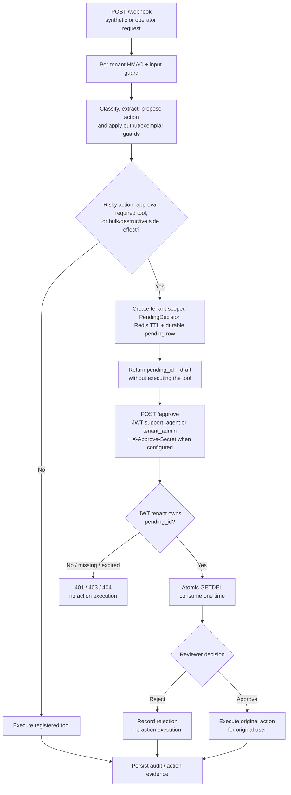

# Human Approval Flow

This diagram maps the implemented local decision path from a signed webhook to
one-time human approval. It is a code-and-test-backed control-flow view, not an
operator UI, production deployment claim, or proof that every policy decision
is correct.



## Implementation Map

| Diagram boundary | Authoritative implementation | Focused proof |
| --- | --- | --- |
| Risk and tool-side-effect gate | `AgentService.needs_approval()` in `app/agent.py` | `tests/test_agent.py`, `tests/test_tool_registry.py` |
| Tenant-scoped pending state and TTL | `RedisApprovalStore` in `app/approval_store.py` | `tests/test_redis_approval_store.py` |
| JWT role and tenant context | `JWTMiddleware` and `require_role()` | `tests/test_auth.py`, `tests/test_rbac.py` |
| Optional approval secret | `ApprovalService.verify_hmac()` | `tests/test_approval_service.py::test_handle_rejects_wrong_approve_secret` |
| Cross-tenant, expired, reject, and one-time behavior | `AgentService.approve()` | `tests/test_approval_flow.py` |
| Approval/rejection audit records | `_record_approval_event()` and event store calls | `tests/test_approval_flow.py`, `tests/test_approval_service.py` |

Run the control-flow regression proof from the repository root:

```bash
PYTHONDONTWRITEBYTECODE=1 LLM_MODE=demo \
  python -m pytest \
  tests/test_approval_flow.py \
  tests/test_approval_service.py \
  tests/test_redis_approval_store.py \
  tests/test_rbac.py -q
```

The default local Compose proof additionally checks database role flags, forced
RLS, tenant-A reads, and cross-tenant write rejection:

```bash
bash scripts/verify_compose_rls.sh
```

## Boundaries and Known Limits

- The diagram shows the repository's current local path. n8n/Telegram button
  rendering and external identity-provider controls are outside this proof.
- `X-Approve-Secret` is a defense-in-depth check only when `APPROVE_SECRET` is
  configured. JWT role and tenant ownership remain required for `/approve`.
- A wrong tenant receives no pending object because Redis keys are tenant
  scoped. Expired and already-consumed decisions also return not found.
- Redis coordinates one-time consumption; Postgres stores durable pending and
  approval records in the configured Compose path. This is not a proof of
  failover behavior for an externally operated deployment.
- The canonical Eval Lab challenge still reports failed human-routing quality
  thresholds. See the [failure preview](evidence/GDEV_EVAL_FAILURE_PREVIEW_2026-07-13.md);
  implemented approval mechanics do not imply that candidate policy routes
  every risky input correctly.
