# gdev-agent Architecture Diagram

This diagram is a review-friendly view of the implemented local stack. It is
pilot/local evidence only and does not claim production deployment readiness.

```mermaid
flowchart LR
    caller[Webhook caller<br/>n8n / Telegram / HTTP] --> webhook[POST /webhook]
    webhook --> signature[Signature middleware<br/>tenant slug + HMAC]
    signature --> rate[Rate limit middleware<br/>tenant/user Redis counters]
    rate --> input_guard[Input guard<br/>length + injection checks]
    input_guard --> llm[LLM tool loop<br/>classify + extract + draft]
    llm --> policy[Policy + output guard<br/>risk, confidence, secrets, URLs]
    policy --> decision{Requires approval?}

    decision -->|No| execute[Execute action<br/>ticket + reply tools]
    decision -->|Yes| approval_store[Approval store<br/>Redis pending decision + TTL]
    approval_store --> approve[POST /approve<br/>JWT role + optional APPROVE_SECRET]
    approve --> execute

    execute --> audit[Audit / tickets / cost ledger<br/>Postgres + RLS]
    execute --> metrics[Metrics + traces + logs<br/>Prometheus / OTel / JSON logs]

    signature -. tenant lookup .-> postgres[(Postgres<br/>tenants, RLS, secrets)]
    approval_store -. pending state .-> redis[(Redis<br/>dedup, approvals, rate limits)]
    audit -. durable state .-> postgres
    metrics -. dashboards .-> observability[Grafana / Loki / Tempo]
```

## What The Diagram Shows

| Boundary | Implemented proof |
| --- | --- |
| Webhook ingress | `POST /webhook`, tenant slug, per-tenant HMAC, and rate limiting. |
| Guardrails | Input guard before model use and output guard before response delivery. |
| LLM workflow | Tool-use classification, extraction, and draft generation. |
| Approval workflow | Redis pending state, JWT-protected `POST /approve`, optional `APPROVE_SECRET`. |
| Execution | Ticket/reply tool registry and audited action execution. |
| Durable tenant data | Postgres tables protected by RLS policies. |
| Ephemeral coordination | Redis keys for dedup, approvals, rate limits, JWT blocklist, and tenant cache. |
| Observability | Prometheus metrics, OpenTelemetry-style spans, JSON logs, Grafana/Loki/Tempo local stack. |

Detailed proof lives in [docs/ARCHITECTURE.md](ARCHITECTURE.md),
[docs/TENANT_ISOLATION.md](TENANT_ISOLATION.md),
[docs/observability.md](observability.md), and
[docs/DEPLOYMENT_READINESS.md](DEPLOYMENT_READINESS.md).
