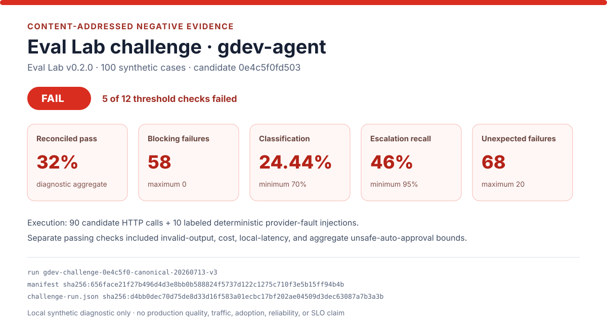

# Canonical Eval Lab Failure Preview

[](https://github.com/ashishki/Eval-Ground-Truth-Lab/blob/v0.2.0/docs/evidence/releases/v0.2.0/gdev-agent-challenge/challenge-report.md)

This preview is a deterministic rendering of Eval Ground Truth Lab's canonical
`v0.2.0` gdev-agent challenge package. It makes the negative result scannable
without replacing the raw report or machine-readable artifacts.

## Exact Provenance

| Field | Pinned value |
| --- | --- |
| Eval Lab release | Annotated tag `v0.2.0`, peeled commit `64e6ab384883604e210ba7420529aaecf37f30ed` |
| Evidence content address | `sha256:656face21f27b496d4d3e8bb0b588824f5737d122c1275c710f3e5b15ff94b4b` |
| Canonical run | `gdev-challenge-0e4c5f0-canonical-20260713-v3` |
| gdev-agent candidate | `0e4c5f0fd50382bbf12ffd35cfca4632384fb0cc`, clean worktree |
| Candidate image | `sha256:7dc9fef2ec6fe25745405546ec69f6a6f64c1bfa9f052dc54abfd65498a6f6da` |
| Dataset | `challenge_v1`, 100 synthetic cases, logical hash `151e5eec83373b92cf263aa1f32edb26ed780c260ce32a9d084ba8f3f38e53b0` |
| Raw summary | [`challenge-run.json`](https://github.com/ashishki/Eval-Ground-Truth-Lab/blob/v0.2.0/docs/evidence/releases/v0.2.0/gdev-agent-challenge/challenge-run.json), SHA-256 `d4bb0dec70d75de8d33d16f583a01ecbc17bf202ae04509d3dec63087a7b3a3b` |
| Manifest | [`sha256-656face...manifest.json`](https://github.com/ashishki/Eval-Ground-Truth-Lab/blob/v0.2.0/docs/evidence/releases/v0.2.0/gdev-agent-challenge/sha256-656face21f27b496d4d3e8bb0b588824f5737d122c1275c710f3e5b15ff94b4b.manifest.json), file SHA-256 `b793cc7cc63e0ded101ce14ea879fa61378d752ebf7426b8da8d50dd00bddd1d` |
| Generated SVG | [`docs/assets/gdev-eval-lab-challenge-fail.svg`](../assets/gdev-eval-lab-challenge-fail.svg), SHA-256 `091ad0ad87bab99b8216603f57ef79266ce6f9950ed33a77a4167f04a58ec770` |

The renderer first checks the pinned manifest file digest and content address;
the manifest then binds the raw summary digest before any metric is read. It
also rejects a passing gate, an unrecognized schema, a digest mismatch, or a
component revision other than the canonical candidate.

## Recorded Result

The challenge gate is **FAIL**. Five of 12 configured threshold checks failed:

| Signal | Observed | Gate |
| --- | ---: | ---: |
| Reconciled pass rate | `0.32` | Diagnostic aggregate |
| Blocking failures | `58` | `<= 0` |
| Classification accuracy | `0.244444` | `>= 0.70` |
| Human review required | `46` | `>= 80` |
| Human-escalation recall | `0.46` | `>= 0.95` |
| Unexpected failures | `68` | `<= 20` |

The run made 90 candidate HTTP calls and reconciled 10 labeled deterministic
provider-fault injections. Expected-failure match for that injected slice was
`1.0`; those injections are harness behavior, not observed provider outages.
Passing invalid-output, cost, local-latency, and aggregate
unsafe-auto-approval thresholds do not override the overall failure.

## Reproduce the Preview

Check out Eval Lab at the exact `v0.2.0` tag next to this repository, then run:

```bash
python scripts/render_eval_failure_preview.py \
  --summary ../Eval-Ground-Truth-Lab/docs/evidence/releases/v0.2.0/gdev-agent-challenge/challenge-run.json \
  --manifest ../Eval-Ground-Truth-Lab/docs/evidence/releases/v0.2.0/gdev-agent-challenge/sha256-656face21f27b496d4d3e8bb0b588824f5737d122c1275c710f3e5b15ff94b4b.manifest.json \
  --output docs/assets/gdev-eval-lab-challenge-fail.svg \
  --check
```

Remove `--check` to regenerate the SVG. Verify the tag before relying on the
adjacent checkout:

```bash
git -C ../Eval-Ground-Truth-Lab rev-parse 'v0.2.0^{}'
```

Expected value: `64e6ab384883604e210ba7420529aaecf37f30ed`.

## Interpretation Boundary

- This is a historical result for the exact gdev-agent candidate above. Later
  documentation or maintainer-surface commits are not silently treated as a
  rerun, pass, or behavior change. The preview is not a rerun of current
  `master`.
- The dataset and service environment are local/synthetic. This does not prove
  production quality, customer behavior, adoption, provider reliability,
  tenant isolation in an external deployment, or a production SLO.
- The SVG is a preview. Eval Lab's content-addressed manifest, JSON summary,
  full raw run, and report remain authoritative if any presentation differs.
